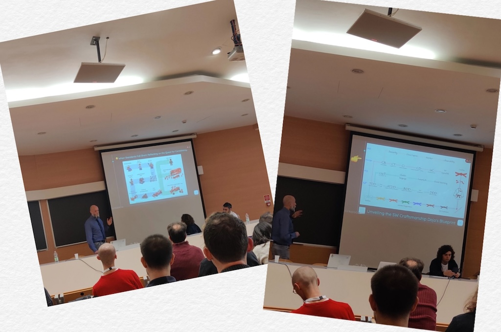

# Building a Culture of SW Craftsmanship: My Talk at IAD23

## 🍿 Teaser
Before the talk, I set the stage with a [Medium teaser](https://medium.com/p/caf7f20b38b5).

---

## 📬 Introduction
Delighted to be a speaker at Italy's premier agile conference, [IAD23](https://www.agileday.it/), I dived into the world of software development at 14:40 on the 18th of November. My focus was on **Building a Culture of SW Craftsmanship** and its intersection with Internal Development Platforms (IDPs).

## 🎙️ Talk Overview - Building a Culture of SW Craftsmanship
In this engaging talk, we explored the correlation of IDPs on code quality. While known for speeding up delivery, IDPs alone couldn't promise substantial improvements in code quality. We delved into the limitations, presenting compelling data to illustrate the code quality gap.
During the session, I used a visually engaging [slide deck](https://github.com/undeadgrishnackh/iad23/blob/main/202311_AgileDays_Italy.pdf) to ensure clarity and audience engagement.

[🎁 Download ME - Iad23.pdf](https://github.com/undeadgrishnackh/iad23/blob/main/202311_AgileDays_Italy.pdf)

## 🎥 Talk Recording

🚧 Work in progress 🚧

---

## 👉 TLDR: The Conclusion
The takeaway? **The combination of IDPs and SW Craftsmanship practices is the key to comprehensive improvements in code quality, delivery speed, and team happiness.** Relying solely on IDPs falls short. SW Craftsmanship practices bridge the gap, with my SW Craftsmanship dojo serving as a continuous training system. This innovative approach, backed by neuroscience and behavioral psychology, ensures sustainable learning and broad adoption across organizations.

---

## 🎉 The Solution: SW Craftsmanship Dojo

<!-- add the logo as an image -->

The key revelation? The SW Craftsmanship dojo, acts as the vital bridge between IDPs and code quality enhancement. Embracing principles such as code reviews, test-driven development (TDD), time management, focus, and collaboration, organizations can witness transformative improvements in code quality and team satisfaction.

### 🔎 Dive Deeper
To explore the SW Craftsmanship dojo further, visit the [SW Craftsmanship Dojo Website](https://swcraftsmanshipdojo.com/) or our open-source version of the [SW Craftsmanship Dojo](https://github.com/undeadgrishnackh/sw_craftsmanship_dojo).

---

## Conclusion - IDP isn't enough!
[Join me](https://swcraftsmanshipdojo.com/) in revolutionizing your approach to code quality, driving organizational excellence, and elevating your software development practices to new heights.